# 01 - Project Setup and Configuration
After initializing our GitHub repository, we will setup the configuration services so our applications can get secrets and settings without having to put compromising information in your source code repositories.  We will also create the Azure resources that will be used throughout the workshop.

**Tasks**
- 01A - [Initialize GitHub Repo](#initialize-github-repo-01a)
- 01B - [Clone GitHubRepo](#clone-github-repo-01b)
- 01C - [Create a resource group](#create-a-resource-group-01c)
- 01D - [Create an Azure Key Vault vault](#create-an-azure-key-vault-vault-01d)
- 01E - [Create an App Configuration store](#create-an-app-configuration-store-01e)
- 01F - [Create Cosmos DB account](#create-cosmos-db-account-01f)
- 01G - [Add Cosmos DB Primary Key to Key Vault](#add-cosmos-db-primary-key-to-key-vault-01g)
- 01H - [Initialize the GitHub Repo for the Workshop](#initialize-the-github-repo-for-the-workshop-O1h)

## Initialize GitHub Repo (01A)
Log into your GitHub account and create a new repository for the workshop

Log into your GitHub account and fork the base Order Processing System repository into your account.

1. Navigate to the [base Order Processing System repository](https://github.com/TaleLearnCode/DesignDevelopServerlessEventDrivenMicroserviceSolution-BaseSolution).
1. Click the **Fork** button in the upper right corner of the page.

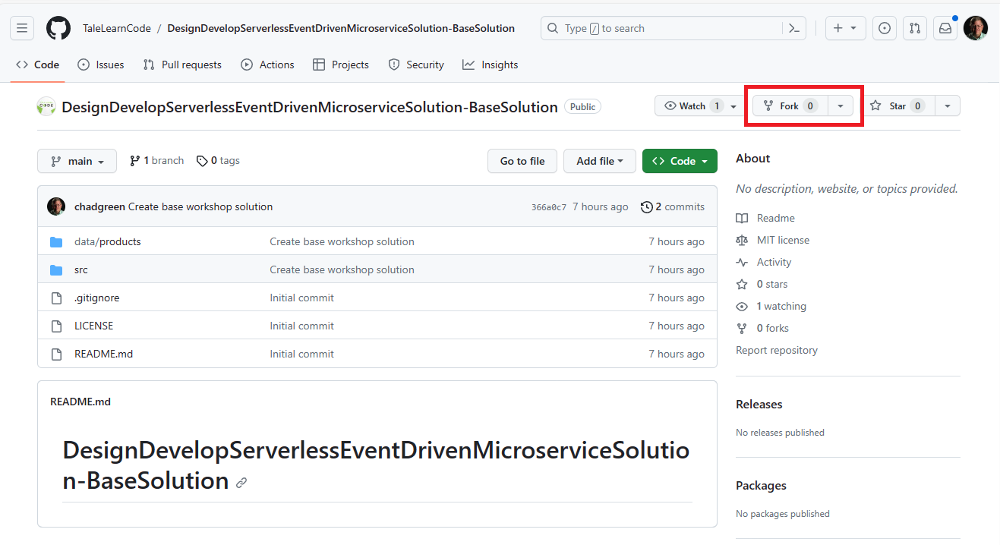

1. Select your GitHub account as the location to fork the repository and specify the name of the new repository

1. Once the fork is complete, you will be taken to your forked repository.
1. Click the **Settings** tab.
1. CLick the **Branches** menu item.
1. Click the **Add branch protection rule** button.
1. Enter **main** for the **Branch name pattern**.
1. Check the **Require a pull request before merging** checkbox.
1. Ensure the **Require approvals** checkbox is checked.
1. Create the **Create** button.

## Clone GitHub Repo (01B)
1. Click the **Code** tab.
1. CLick the **Code** button.
1. Click the copy button in order to copy the HTTPS URL to the clipboard.
1. Open Visual Studio
1. From the **Start** page, select **Clone a repository**.
1. Past the URL copied in step 3 into the **Repository location** field.
1. Click the **Clone** button.

## Create a resource group (01C)
A resource group is a container that holds related resources for an Azure solution.  The resource group can include all the resources for the solution, or only those resources that you want to manage as a group.  You decide how you want to allocate resources to resource groups based on what makes the most sense for your organization.  Generally, add resources that share the same lifecycle to the same resource group so you can easily deploy, update, and delete them as a group.

The resource group stores metadata about the resources.  Therefore, when you specify a location for the resource group, you are specifying where that metadata is stored.  For compliance reasons, you may need to ensure that your data is store in a particular reason.

For this workshop, everything you create will be done so in the same resource group.  The benefit to this is that you can easily clean up all of the workshop resources once you are done.

1. Sign in to the [Azure portal](https://portal.azure.com).
2. Click on the **Create a resource** quick action

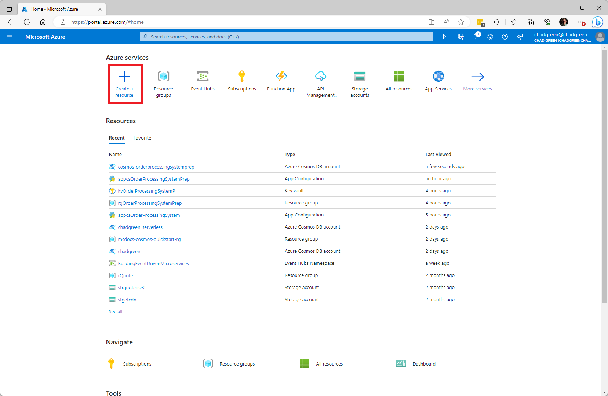

3. From the **Create a resource** page, search for '*resource group*'

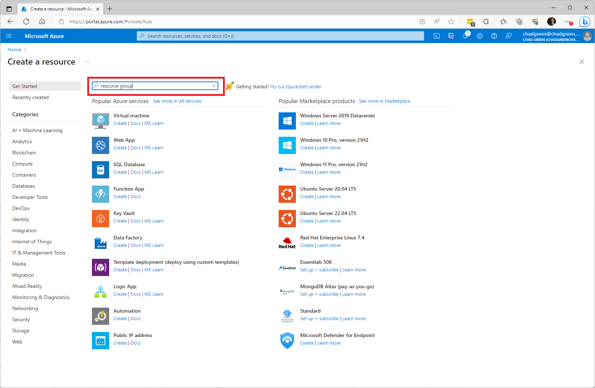

4. Select **Resource group**.

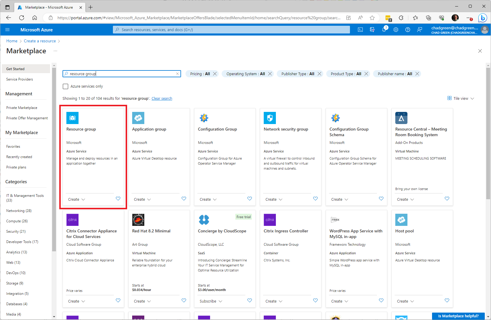

5. CLick on the **Create** button.

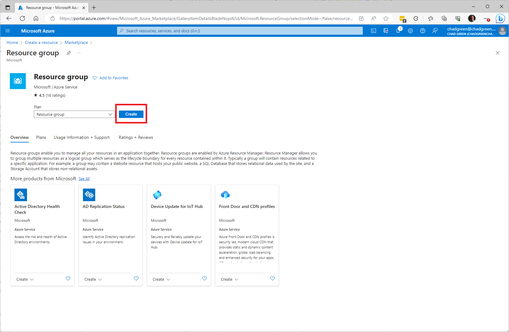

6. Enter the following values

- **Subscription:** Select your Azure subscription
- **Resource group:** Enter a new resource group name
- **Region:** Select an Azure location, such as **(US) East US 2**

7. Click the **Review + Create** button

8. Click the **Create** button.

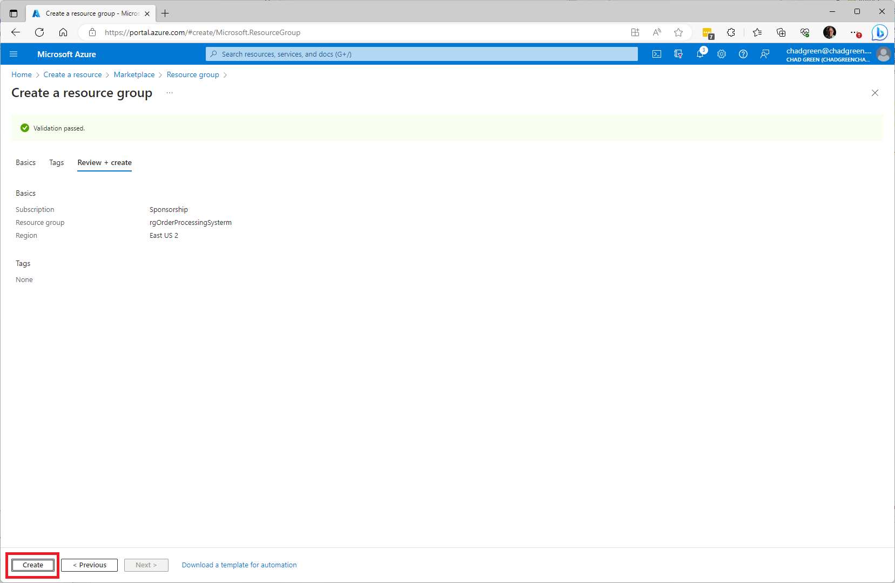

9. It will take a few seconds to create a resource group.  Once completed, click the **Go to resource group** button within the notification.

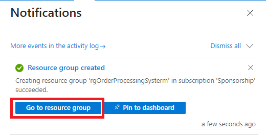

## Create an Azure Key Vault vault (01D)
Centralized storage of application secrets in Azure Key Vault allows you to control their distribution.  Key Vault greatly reduces the changes that secrets may be accidently leaked.  When application developers use Key Vault, they no longer need to store security information in their application.  Not having to store security information in applications eliminates the need to make this information part of the code.  For example, an application may need to connect to a databae.  Instead of storing the connection string in the application's code, you can store it securely in Key Vault.

1. From the resource group resource listing page, click the **+ Create** button

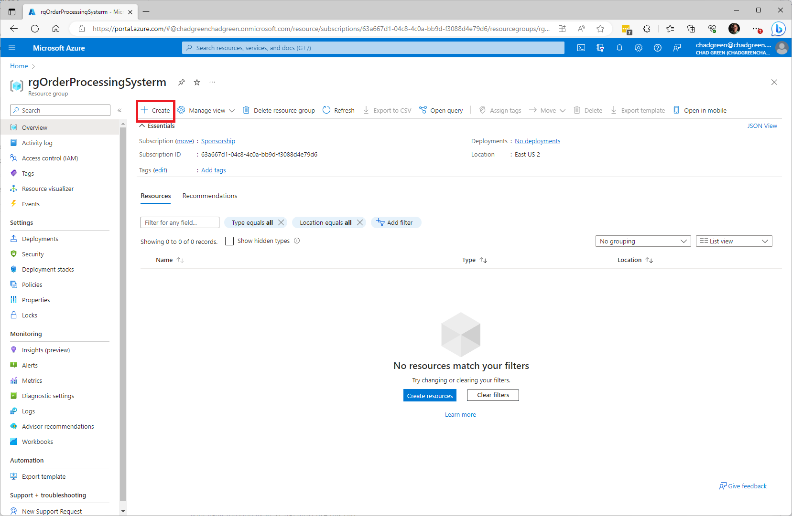

2. In the Search box, enter **Key Vault**
3. From the results list, choose **Key Vault**
4. On the Key Vault section, choose **Create**
5. On the **Create key vault** section, provide the following information:

- **Name:** A unique name is required.
- **Subscription:** Choose a subscription.
- Under **Resource Group**, choose the 
- Select the appropriate **Region**
- Select the *Standard* **Pricing tier**

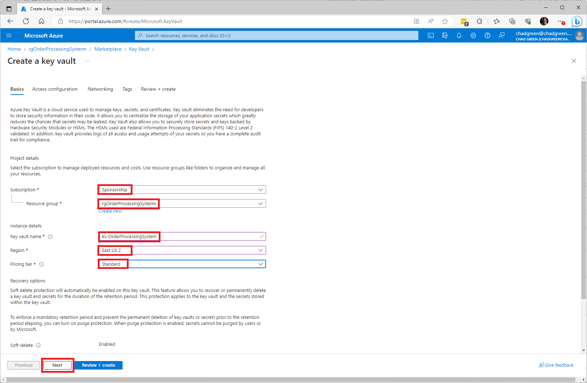

6. Click on the Next button
7. Select **Vault access policy**, click on your name to give yourself access, and click the **Review + create** button

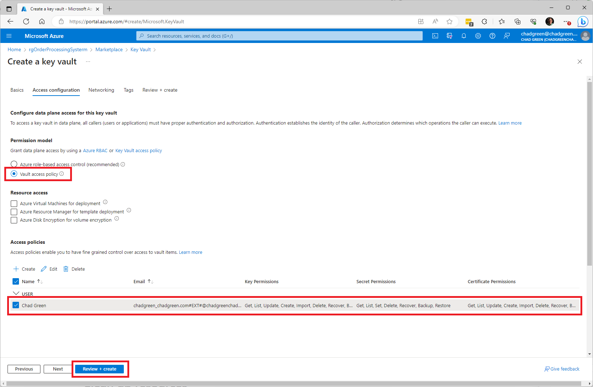

8. Click the **Create** button

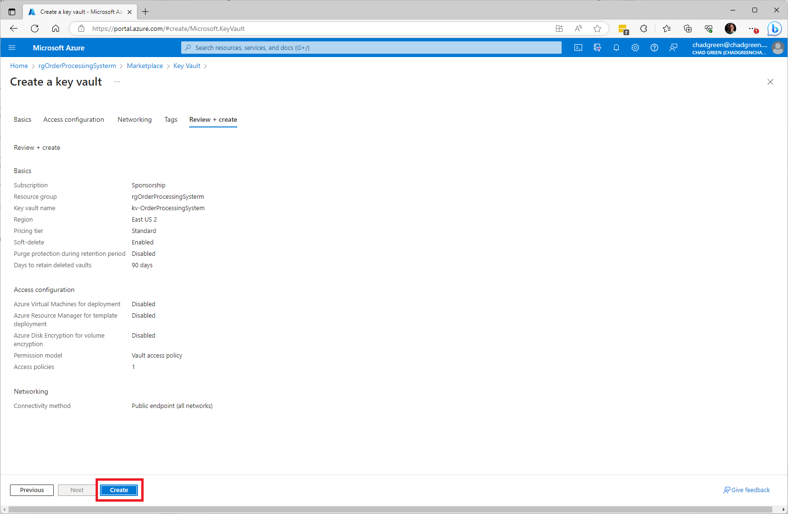

## Create an App Configuration store (01E)

Azure App Configuration is an Azure service designed to help you centrally manage your app settings and feature flags.  In this step, you will create an App Configuration store to be used for the workshop.

1. From the Azure portal, enter *App Configuration* in the search box at the top and select **App Configuration** from the search results.

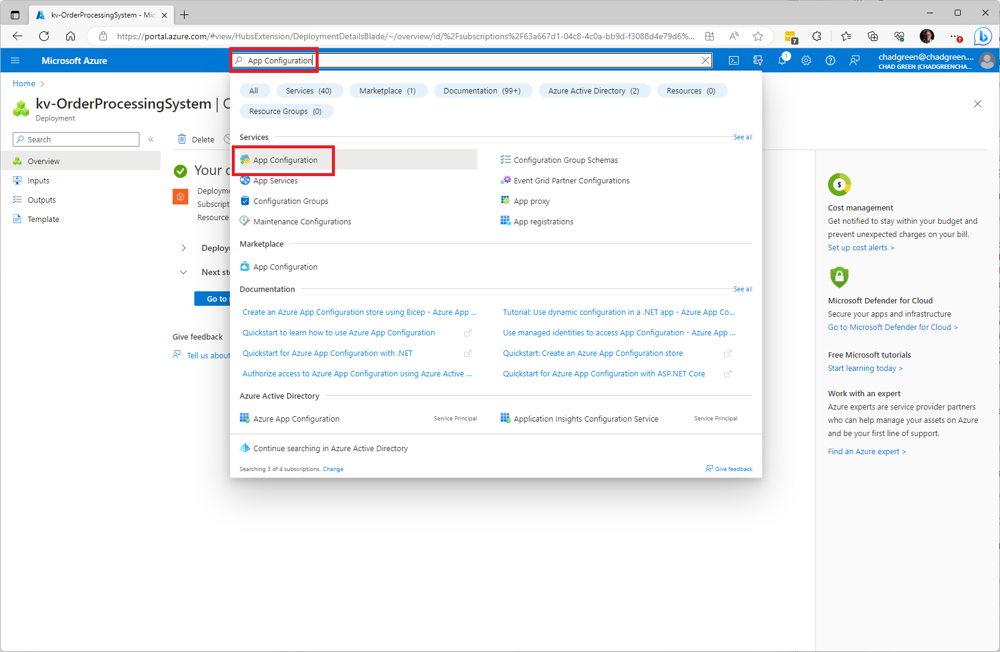

2. Click the **+ Create** button.

3. In the **Basics** tab, enter the following settings:

| Settings | Suggested value | Description |
|----------|-----------------|-------------|
| Subscription | Your subscription | Select the Azure subscription that you want to use to create an App Configuration store.  If your account has only one subscription, it's automatically selected and the **Subscription** list is not display. |
| Resource group | The resource group you created in step 01A. | Select or create a resource group for your App Configuration store resource.  A resource group can be used to organize and manage multiple resources at the same time, such as deleting multiple resources in a single operation by deleting their resource group. |
| Location | *East US 2* | Use **Location** to specify the geographic location in which your app configuration store is hosted.  For the best performance, create the resource in the same region as other components of your application. |
| Resource name | Global unique name | Enter a unique resource name to use for the App Configuration store resource.  The name must be a string between 5 and 50 characters and contain only numbers, letters, and the - character.  The cannot start or end with the - character. |
| Pricing tier | *Free* | Selecting **Free**.  If you select the standard tier, you can also get access to geo-replication and soft-delete features. |

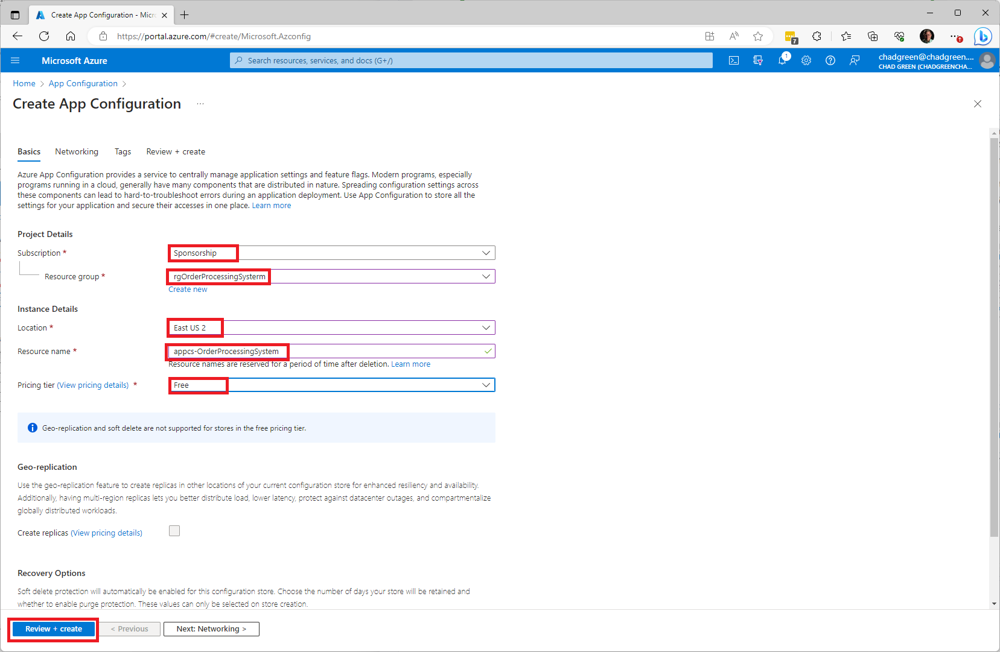

4. Click the **Review + create** button.
5. Click the **Create** button.  The deployment might take a few minutes.
1. Click the **Go to resource** button.
1. Click the **Access control (IAM)** menu option.
1. Click the **+ Add role assignment** button.
1. Select the **App Configuration Data Reader** role.
1. Click the **Next** button.
1. CLick the **+ Select members** link.
1. Select your account.
1. Click the **Select** button.

14. Click the **Review + assign** button.

## Create Cosmos DB account (01F)
Azure Cosmos DB is Microsoft's globally distributed multi-model database service.  You can use Azure Cosmos DB to quickly create and query key/value databses, document databses, and graph databases.  This approach benefits from the global distribution and horizontal scale capabilities at the core of Azure Cosmos DB.

1. From the Azure portal menu or the **Home page**, select **+ Create a resource**.

2. Search for **Azure Cosmos DB**. Click **Create > Azure Cosmos DB**.

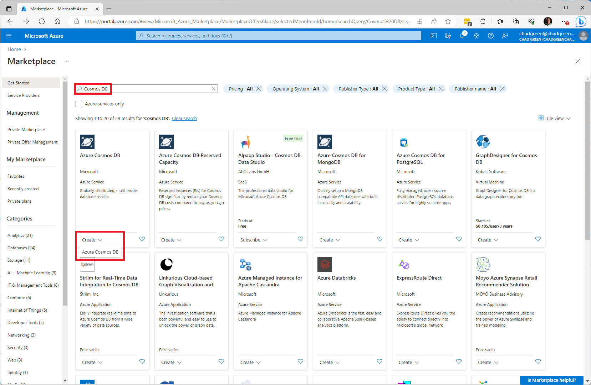

3. Click the **Create** button within the *Azure Cosmos DB for NoSQL* panel.

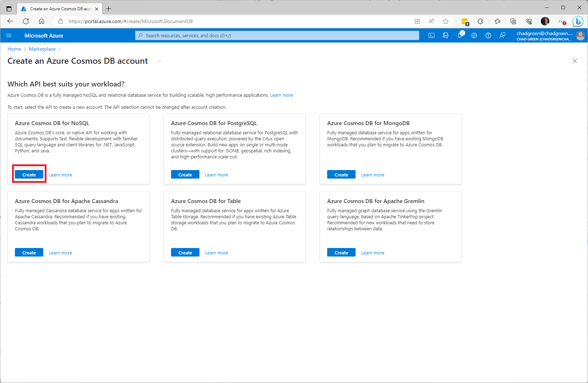

4. On the **Create Azure Cosmos DB Account - Azure Cosmos DB for NoSQL** page, enter the basic settings for the new Azure Cosmos DB account.

| Setting | Value | Description |
|---------|-------|-------------|
| Subscription | Subscription name | Select the Azure subscription that you want to use for this Azure Cosmos DB account. |
| Resource Group | Resource group name | Select the resource group created in step 01A. |
| Account Name | A unique name | Enter a name to identify your Azure Cosmos DB account.  Because *documents.azure.com* is appended to the name that your provide to create your URI, use a unique name.  The can contain only lowercase letters, numbers, and the hypen (-) character. It must be 3-44 characters. |
| Location | The region closest to your users | Select a geographic location to host your Azure Cosmos DB account. Use the location that is closest to your users to give them the fastest access to the data. |
| Capacity mode | **Serverless** | Select **Serverless** in order to create an account in serverless mode. |

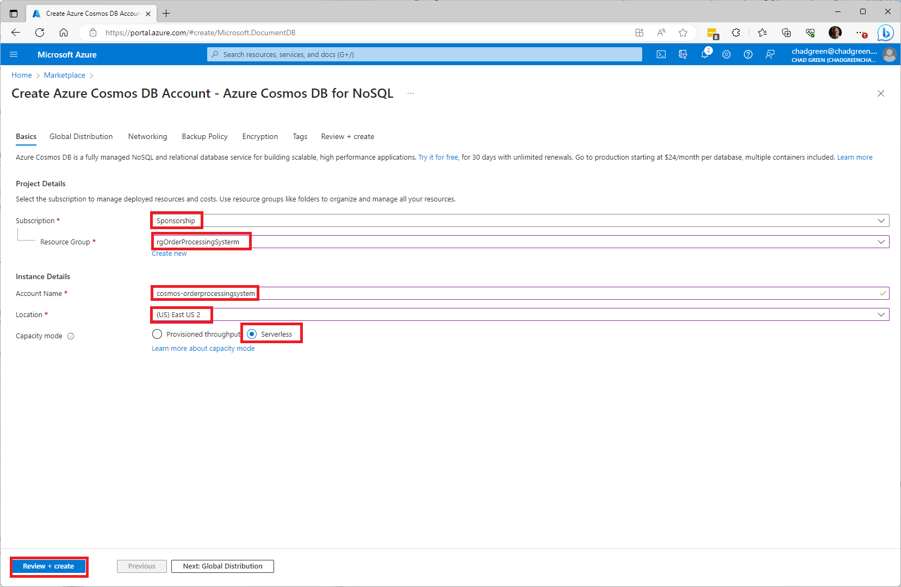

5. Review the account settings and then click the **Create** button.

It takes a few minutes to create the account.  Wait for the portal page to display **Your deployment is complete**.

6. Select **Go to resource** to go to the Azure Cosmos DB account page.

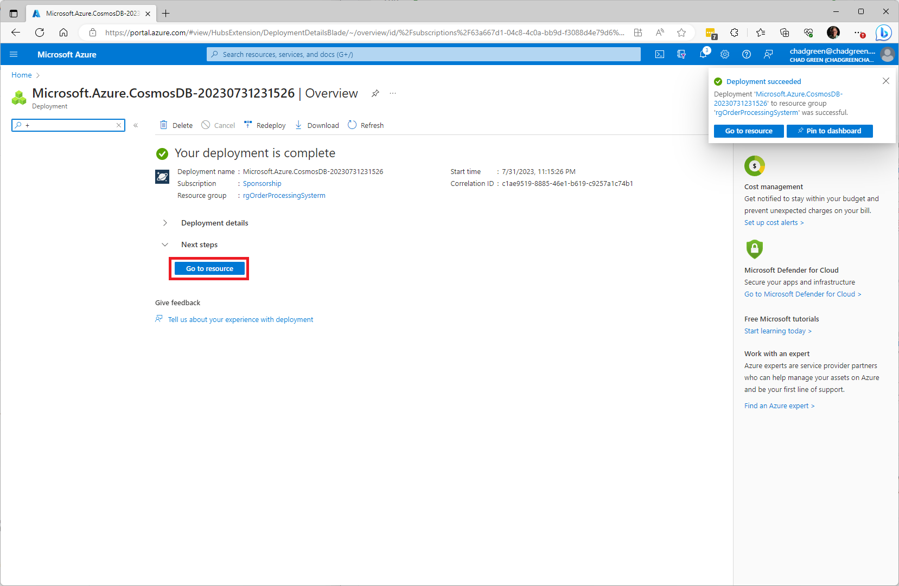

7. Click on the **Keys** menu option.

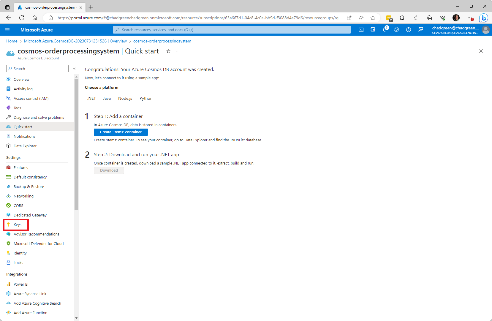

8. Make note of the **URI** and **PRIMARY KEY** values.

## Add Cosmos DB Primary Key to Key Vault (01G)
1. Search for the Azure Key Vault you created in step 01C.

2. Click on the **Secrets** menu option.

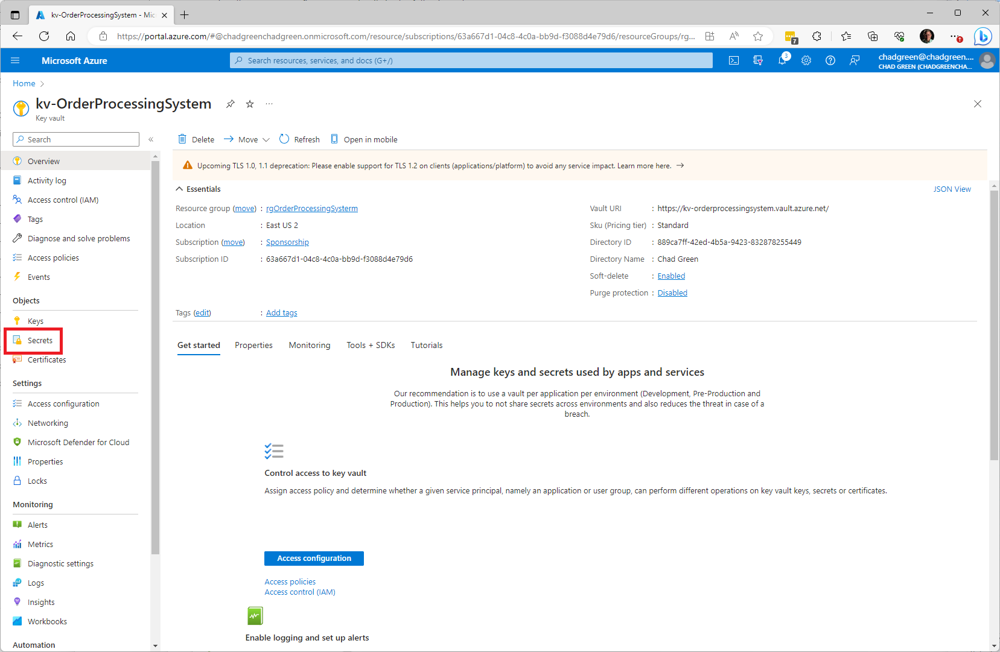

3. Click on the **+ Generate/Import** button.

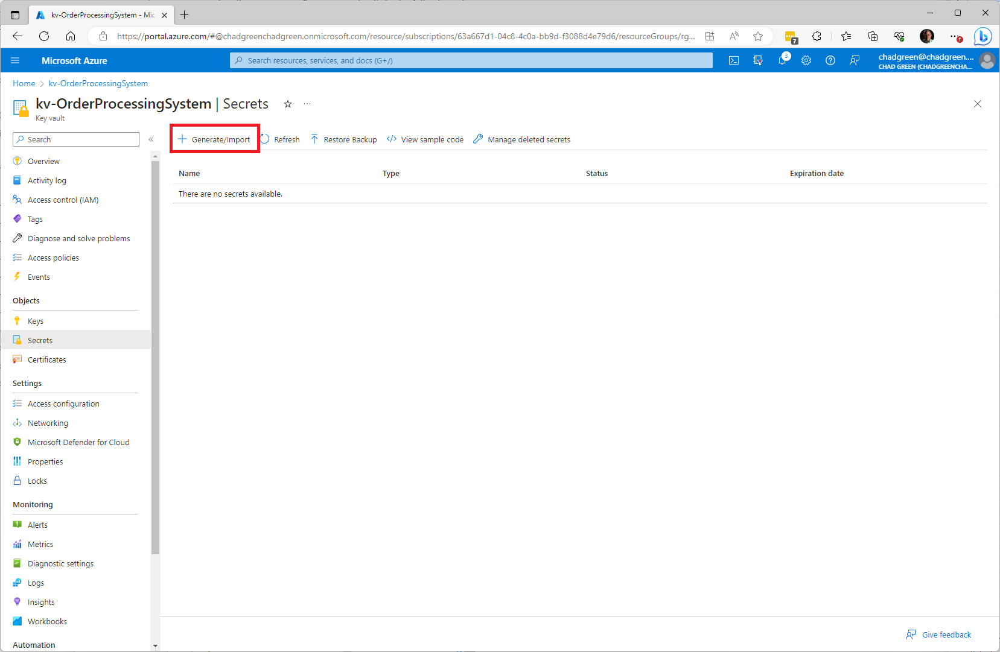

4. Enter the following values:

| Setting | Value |
|---------|-------|
| Name | A unique name for the secret you are creating. |
| Secret Value | The primary key you copy from the Azure Cosmos DB page. |

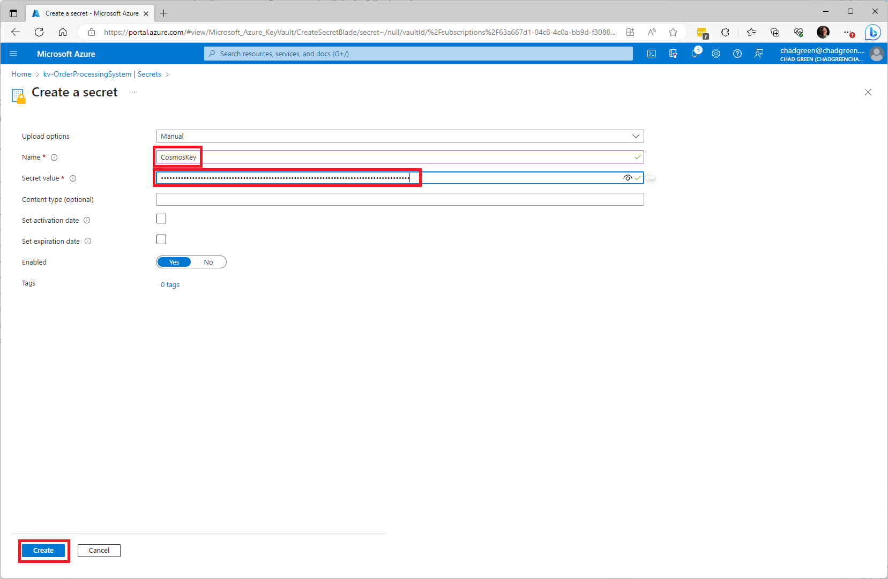

5. Click the **Create** button.
6. Click on the newly created secret.

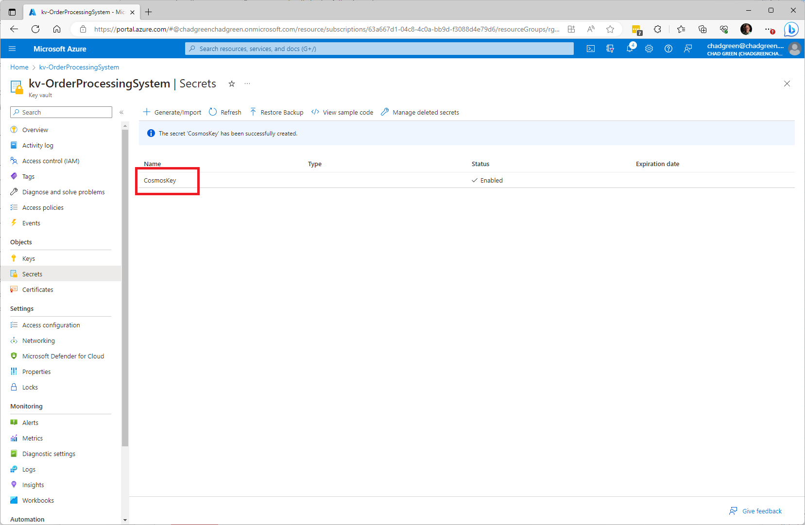

7. Click on the current version of the newly created secret.

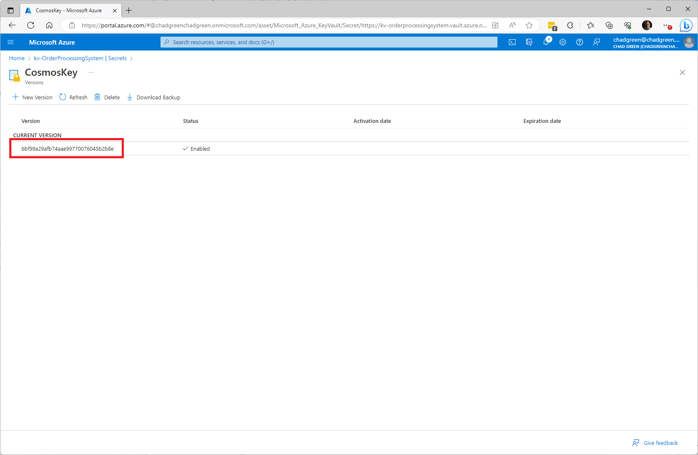

8. Make note of the **Secret Identifier**.

## Initialize the GitHub Repo for the Workshop (O1H)
1. Return to your *Order Processing System* GitHub repository
1. From within your workshop repository, click on the **Settings** tab
1. Click on the **Secrets and variables** menu item and then the **Actions** menu item

1. Click on the **New repository secret** button

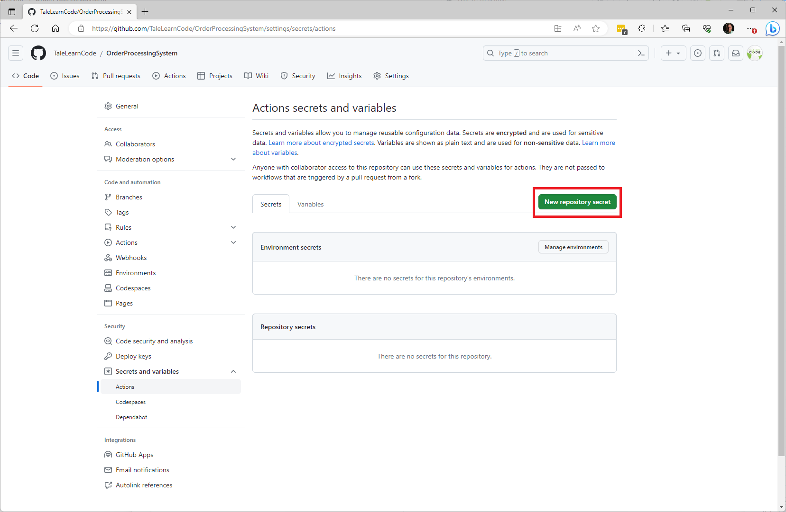

5. Enter *AppConfigConnectionString* as the **Name** and paste the Azure App Configuration store connection string copied from step 01C

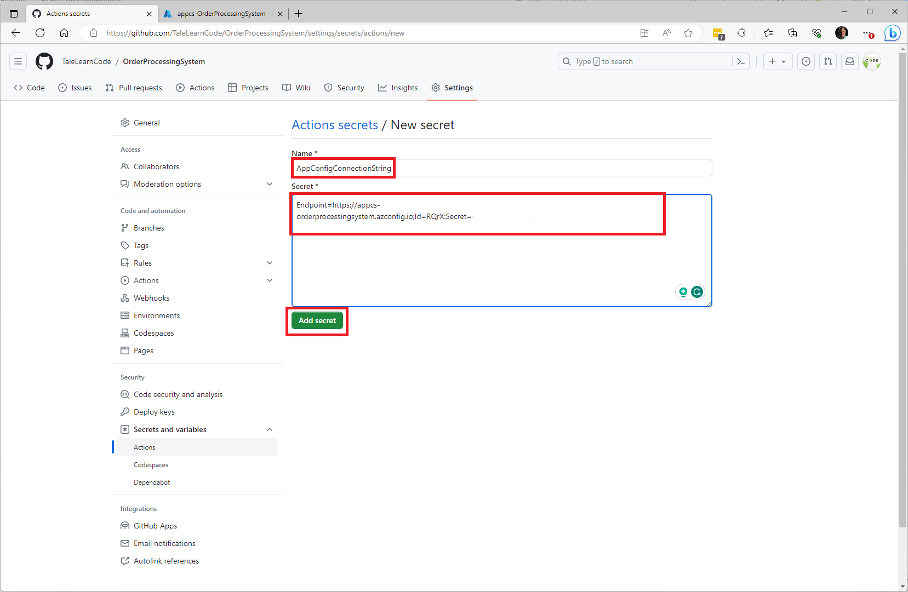

6. Click the **Add secret** button
7. Click on the **Actions** tab
8. Click on the **set up a workflow yourself** link

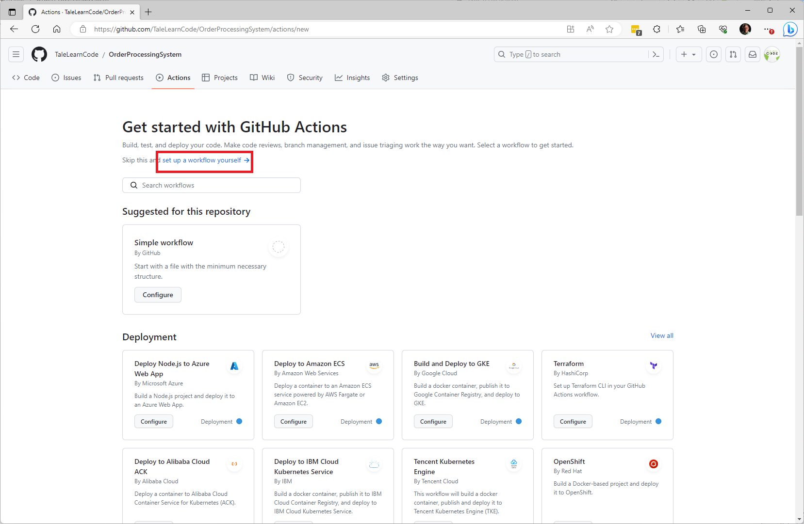

9. Paste the following

~~~
name: AppConfig

on:
  push:
    branches:
      - 'main'
    paths:
      - 'config/appsettings.json'
      - 'config/secretreferences.json'

jobs:
  syncconfig:
    runs-on: ubuntu-latest
    steps:
      # checkout done so that files in the repo can be read by the sync
      - uses: actions/checkout@v1
      - uses: azure/appconfiguration-sync@v1
        with:
          configurationFile: 'config/appsettings.json'
          format: 'json'
          connectionString: ${{ secrets.APPCONFIGCONNECTIONSTRING }}
          separator: ':'
          strict: true
      - uses: azure/appconfiguration-sync@v1
        with:
          configurationFile: 'config/secretreferences.json'
          format: 'json'
          connectionString: ${{ secrets.APPCONFIGCONNECTIONSTRING }}
          separator: ':'
          contentType: 'application/vnd.microsoft.appconfig.keyvaultref+json;charset=utf-8'
~~~

10. Click the **Commit changes** button
11. Add a file named *config/appsettings.json*
12. Paste the following into the *appsettings.json* file

~~~
{
  "Cosmos": {
    "Uri": "{CosmosDBUri}"
  },
  "Product": {
    "Cosmos": {
      "DatabaseId": "products",
      "Metadata": {
        "ContainerId": "metadata",
        "PartitionKey": "/metadataType"
      },
      "Merchandise": {
        "ContainerId": "merchandise",
        "PartitionKey": "/id"
      },
      "MerchandiseByAvailability": {
        "ContainerId": "merchandiseByAvailability",
        "PartitionKey": "/availabilityId"
      },
      "MerchandiseByTheme": {
        "ContainerId": "merchandiseByTheme",
        "PartitionKey": "/themeId"
      }
    }
  }
}
~~~

13. Replace *{CosmosDBUri}* with the URI value copied in step 01E
14. Click the **Commit changes** button
15. Add a file named *config/secretreferences.json*
16. Paste the following into the *config/secretreferences.json* file

~~~
{
  "Cosmos": {
    "Key": "{\"uri\":\"[SecretIdentifer]\"}"
  }
}
~~~

17. Replace *[SecretIdentifier]* with the secret identifier noted from step 01F without the version reference

18. Click the **Commit changes** button
19. Navigate to the **Actions** tab of the repository
20. Validate that the **AppConfig** Action ran twice with the second run being successful.

> The first run will fail because the secretreferences.json file was not created when it ran.
