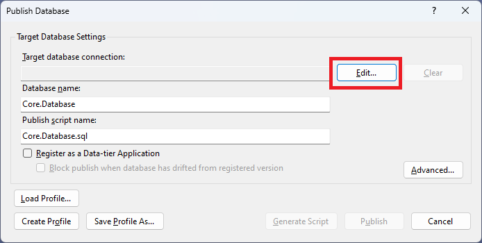
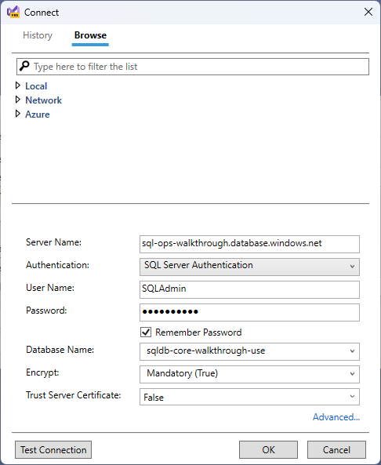

#02 - Initialize Databases
Now we will initialize the databases for use within the workshop.

**Tasks**
- 02A - [Create the Core Database](#create-the-core-database-02a)
- 02B - [Create the Inventory Database](#create-the-inventory-database-02b)
- 02C - [Create the Notice Database](#create-the-notice-database-02c)
- 02D - [Create the Purchase Database](#create-the-purchase-database-02d)
- 02E - [Create the Shipping Database](#create-the-shipping-database-02e)
- 02F - [Initialize the Core Database Schema and Data](#create-the-core-database-schema-02f)
- 02G - [Initialize the Inventory Database Schema and Data](#create-the-inventory-database-schema-02f)
- 02H - [Initialize the Notice Database Schema and Data](#create-the-notice-database-schema-02h)
- 02I - [Initialize the Purchase Database Schema and Data](#create-the-purchase-database-schema-02i)

## Create the Core Database (02A)
1. Navigate to the [Azure Portal](https://portal.azure.com)
1. Click the **Create a resource** button in the top left corner of the portal
1. Search for **SQL Database** and click the **Create** button
1. Fill out the form with the following values:
		- **Subscription**: Select the appropriate Azure subscription
		- **Resource Group**: Select the resource group you created in the previous section
		- **Database name**: Enter a name for your database
		- **Server**: Click **Create new** and enter a name for your server
    - **Authentication method**: Select **Use SQL authentication**
		- **Server admin login**: Enter a username for your server
		- **Password**: Enter a password for your server
		- **Location**: Select the location you used for your resource group
		- **Want to use SQL elastic pool?**: Select **No**
		- **Workload environment**: Select **Development**
1. Click the **Review + create** button
1. CLick the **Create** button
1. After the database has been created, click on the **Go to Resource** button
1. Under **Configure access**, click the **Configure** button
1. From the **Public access** tab, ensure that **Selected networks** is selected
1. CLick the **Add your client IPv4 address(xxx.xxx.xxx.xxx)** button
1. Ensure that **Allow Azure services and resources to access this server** is selected
1. Click the **Save** button

## Create the Inventory Database (02B)
1. Click the **Overview** button on the left side of the portal
1. Click the **Create database** button
1. Fill out the form with the following values:
		- **Database name**: Enter a name for your database
		- **Want to use SQL elastic pool?**: Select **No**
		- **Workload environment**: Select **Development**
1. Click the **Review + create** button
1. CLick the **Create** button
1. Click the **Go to resource** button
1. Click the **Server name** link

## Create the Notice Database (02C)
1. Click the **Create database** button
1. Fill out the form with the following values:
		- **Database name**: Enter a name for your database
		- **Want to use SQL elastic pool?**: Select **No**
		- **Workload environment**: Select **Development**
1. Click the **Review + create** button
1. CLick the **Create** button
1. Click the **Go to resource** button
1. Click the **Server name** link

## Create the Purchase Database (02D)
1. Click the **Create database** button
1. Fill out the form with the following values:
		- **Database name**: Enter a name for your database
		- **Want to use SQL elastic pool?**: Select **No**
		- **Workload environment**: Select **Development**
1. Click the **Review + create** button
1. CLick the **Create** button
1. Click the **Go to resource** button
1. Click the **Server name** link

## Create the Shipping Database (02E)
1. Click the **Create database** button
1. Fill out the form with the following values:
		- **Database name**: Enter a name for your database
		- **Want to use SQL elastic pool?**: Select **No**
		- **Workload environment**: Select **Development**
1. Click the **Review + create** button
1. CLick the **Create** button
1. Click the **Go to resource** button
1. Click the **Server name** link

## Initialize the Core Database Schema and Data (02F)
1. From the database listing, click on the *Core* database that you created
1. Hover over the **Server name** link and click the **Copy** button
1. From Visual Studio, right click on the *Core.Database* project and select **Publish**
1. The **Publish Database** window will appear, click the **Edit** button

1. Click the **Browse** tab
1. Paste the server name into the **Server name** field
1. Change	**Authentication** to **SQL Server Authentication**
1. Enter the appropriate **User Name** and **Password** for the server
1. Ensure that **Save Password** is checked
1. Select the **Core** database from the **Database name** dropdown
1. Set **Trust Server Certificate** to **True**
1. Click the **OK** button

1. CLick the **Publish** button

## Initialize the Inventory Database Schema and Data (02G)
1. From Visual Studio, right click on the *Inventory.Database* project and select **Publish**
1. The **Publish Database** window will appear, click the **Edit** button
1. From the **History** tab, click on the **Core** database you just used
1. Click **Show Connection Properties**
1. Select the **Inventory** database from the **Database name** dropdown
1. Set **Trust Server Certificate** to **True**
1. Click the **OK** button

1. CLick the **Publish** button

## Initialize the Notice Database Schema and Data (02H)
1. From Visual Studio, right click on the *Notice.Database* project and select **Publish**
1. The **Publish Database** window will appear, click the **Edit** button
1. From the **History** tab, click on the **Inventory** database you just used
1. Click **Show Connection Properties**
1. Select the **Notice** database from the **Database name** dropdown
1. Set **Trust Server Certificate** to **True**
1. Click the **OK** button
1. CLick the **Publish** button

## Initialize the Purchase Database Schema and Data (02I)
1. From Visual Studio, right click on the *Purchase.Database* project and select **Publish**
1. The **Publish Database** window will appear, click the **Edit** button
1. From the **History** tab, click on the **Notice** database you just used
1. Click **Show Connection Properties**
1. Select the **Purchase** database from the **Database name** dropdown
1. Set **Trust Server Certificate** to **True**
1. Click the **OK** button
1. CLick the **Publish** button

## Initialize the Shipping Database Schema and Data (02I)
1. From Visual Studio, right click on the *Shipping.Database* project and select **Publish**
1. The **Publish Database** window will appear, click the **Edit** button
1. From the **History** tab, click on the **Shipping** database you just used
1. Click **Show Connection Properties**
1. Select the **Purchase** database from the **Database name** dropdown
1. Set **Trust Server Certificate** to **True**
1. Click the **OK** button
1. CLick the **Publish** button