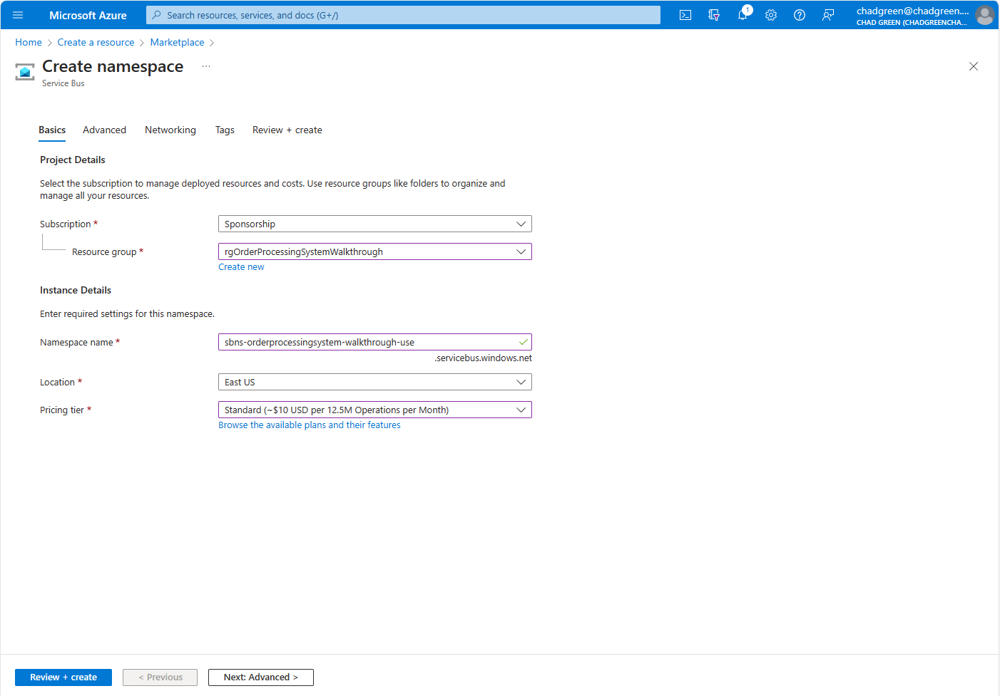
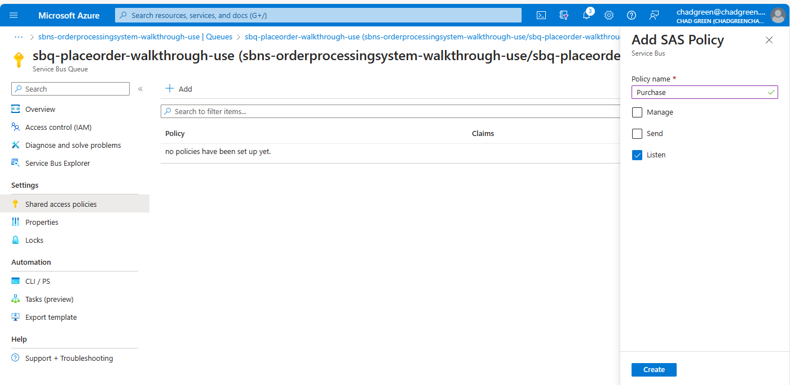
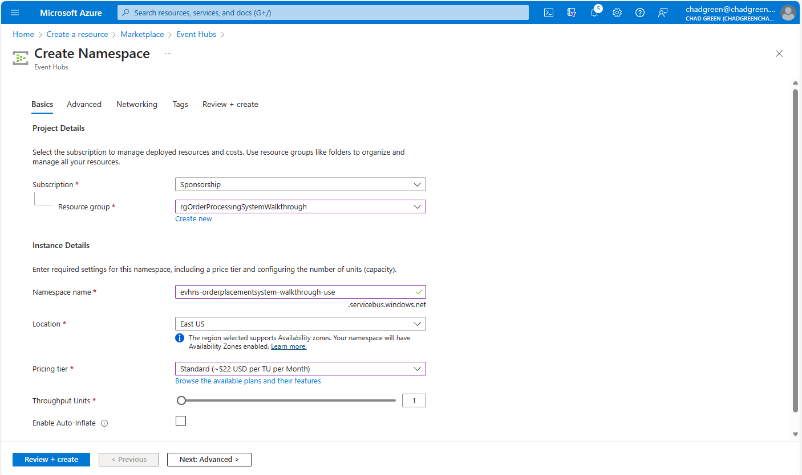
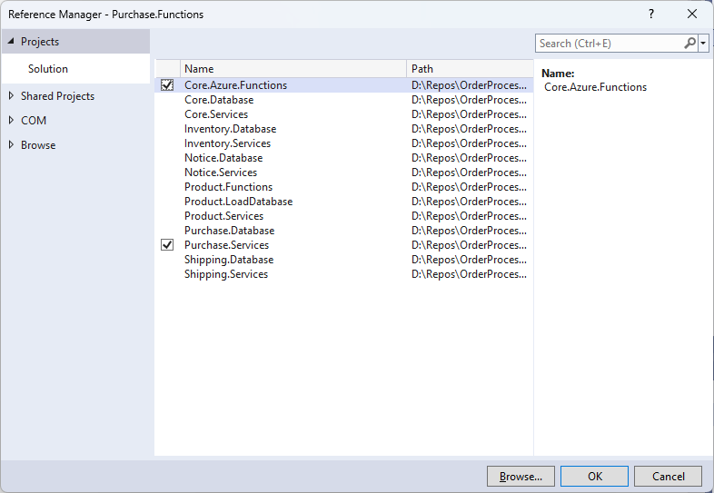
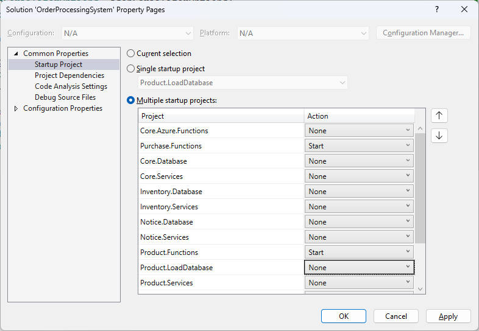
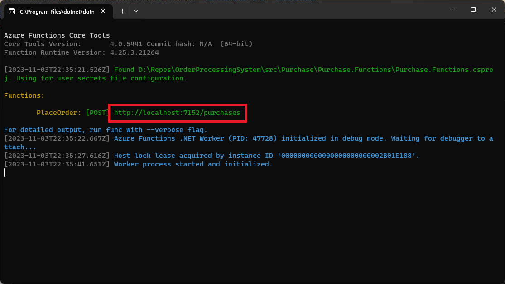
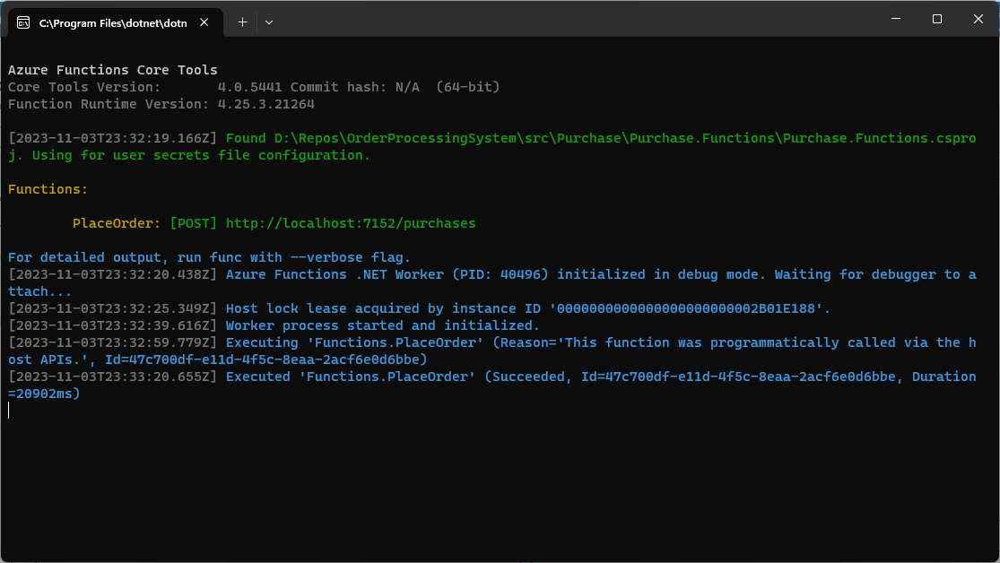
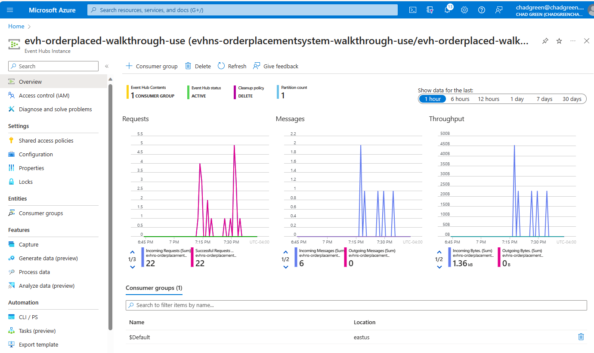
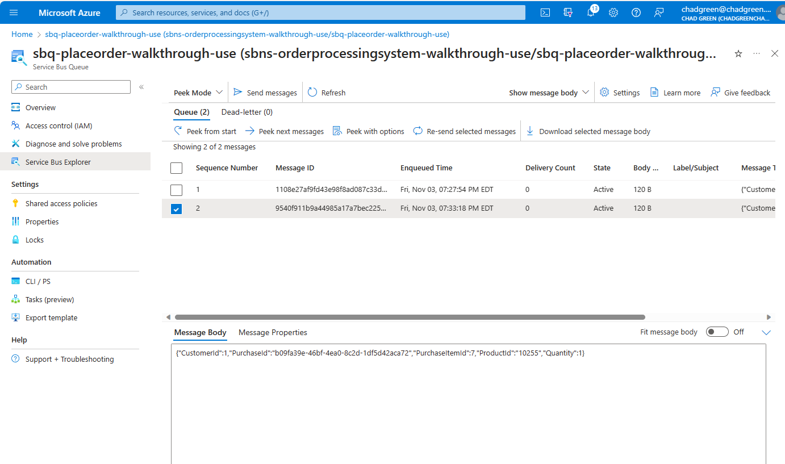

# 04 - Place Order

## User Story
When a customer places an order, the **Purchase** system receives the order and performs the following steps:
- Saves the order details to the Purchase database
- Sends the order details to the **Order Placed** *Service Bus* queue
- Sends the order details to the **Order Placed** *Event Hub*

## Tasks
- 04A - [Create the Service Bus namespace](#create-the-service-bus-namespace-04a)
- 04B - [Create the Place Order Service Bus queue](#create-the-service-bus-queue-04b)
- 04C - [Add a shared access policy for Purchase to access the Place Order Service Bus queue](#add-a-shared-access-policy-for-purchase-to-access-the-place-order-service-bus-queue-04c)
- 04D - [Create the Event Hubs namespace](#create-the-event-hubs-namespace-04d)
- 04E - [Create the Place Order Event Hub](#create-the-place-order-event-hub-04e)
- 04F - [Add service logic for user story](#add-service-logic-for-user-story-04f)
- 04G - [Create restful endpoint to initiate the Place Order user story](#create-restful-endpoint-to-initiate-place-order-user-story-04g)
- 04H - [Test the Place Order User Story](#test-the-place-order-user-story-4H)

### Create the Service Bus namespace (04A)
1. Navigate to the [Azure Portal](https://portal.azure.com/)
1. Click the **Create a resource** button
1. Search for **Service Bus**
1. Click the **Create** button on the *Service Bus* service offering
1. Enter the following information:

- **Subscription**: The subscription you have been using for the workshop
- **Resource Group**: The resource group you have been using for the workshop
- **Namespace Name**: A globally unique name to identify the *Service Bus* namespace
- **Location**: East US
- **Pricing tier:** Standard

6. Click the **Review + create** button
1. Click the **Create** button

### Create the Place Order Service Bus queue (04B)
1. Once the *Service Bus* namespace created above is completed, click on the **Go to resource** button
1. Click on the **+ Queue** button
1. In the **Create queue** dialog, enter the following information:

- **Name**: The name of the place order queue
- **Enable sessions**: Checked

4. Click the **Create** button

### Add a shared access policy for Purchase to access the Place Order Service Bus queue (04C)
1. Click **Queues** option on the left-hand menu
1. Click on the queue you just created
1. Click on the **Shared access policies** option on the left-hand menu
1. Click the **+ Add** button
1. In the **Add SAS Policy** blade, provide the enter the following:

- **Policy name**: Purchase
- **Manage**: Unchecked
- **Send**: Checked
- **Listen**: Unchecked

6. Click the **Create** button

**Add the connection string to Key Vault**
1. Click on the policy you just created
1. Copy the **Primary Connection String**
1. Navigate to the Key Vault account you created for the workshop
1. Click on the **Secrets** option on the left-hand menu
1. Click the **+ Generate/Import** button
1. Enter *ServiceBus-OrderPlaced-Purchase* in the **Name** field
1. Paste the copied primary key into the **Secret value** removing the **EntityPath** portion of the key string.

For example, change:
~~~
Endpoint=sb://sbns-orderprocessingsystem-walkthrough-use.servicebus.windows.net/;SharedAccessKeyName=Purchase;SharedAccessKey=xxxxxxxxxx;EntityPath=sbq-placeorder-walkthrough-use
~~~

To:
~~~
Endpoint=sb://sbns-orderprocessingsystem-walkthrough-use.servicebus.windows.net/;SharedAccessKeyName=Purchase;SharedAccessKey=xxxxxxxxxx
~~~

8. Click the create button

**Add the Key Vault reference to the App Config service**
1. Navigate to your GitHub repository for the workshop
1. Open the **OrderProcessingSystem/config/servicereferences.json** file
1. Add the Purchase:ServiceBus:PlaceOrder:ConnectionString entry

~~~
  "Purchase": {
    "SeviceBus": {
      "PlaceOrder": {
        "ConnectionString": "{\"uri\":\"{YOUR-KEYVALUT-ENDPOINT}/secrets/ServiceBus-OrderPlaced-Purchase\"}"
      }
    }
  }
~~~

4. Click the **Commit Changes** button.

**Add the Service Bus Queue name configuration value**
1. Open the **OrderProcessingSystem/config/appsettings.json** file
1. Add the Purchase:ServiceBus:PlaceOrder:QueueName entry

~~~
  "Purchase": {
    "ServiceBus": {
      "PlaceOrder": {
        "QueueName": "{QUEUE-NAME}"
      }
    }
  }
~~~

3. Click the **Commit Changes** button

**Verify App Config Action ran correctly**

1. Click on the **Actions** tab
1. Ensure that the two association runs ran successfully

### Create the Event Hubs namespace (04D)
1. Navigate to the [Azure Portal](https://portal.azure.com)
1. Click the **+ Add Resource** button
1. Search for **Event Hubs**
1. Click on the **Event Hubs** service offering
1. Click on the **Create** button
1. Enter the following information:

| Field | Value|
|-------|------|
| Subscription | The subscription you have been using for the workshop |
| Resource group | The resource group you have been using for the workshop |
| Namespace name | A globally unique name for the Event Hub namespace |
| Pricing tier | Standard |
| Throughput Units | 1 |
| Enable Auto-Inflate | Unchecked |

7. Click the **Review + create** button
1. Click the **Create** button

### Create the Place Order Event Hub (04E)
1. Once the Event Hubs namespaces created above is completed, click the **Go to resource** button
1. Click the **+ Event Hub** button
1. Enter the following information:

| Field | Value |
|-------|-------|
| Name | The name of the Order Placed event hub |
| Partition count | 1 |
| Cleanup policy | Delete |
| Retention time (hrs) | 1 |

4. Click the **Review + create** button
1. Click the **Create** button

### Add a shared access policy for Purchase to access the Place Order Event Hub (04F)
1. Click on the **Shared access policies** option from the left-hand menu
1. Click the **Add** button
1. In the **Add SAS Policy** blade, enter the following:

| Field | Value |
|-------|-------|
| Policy name | Purchase |
| Manage | Unchecked |
| Send | Check |
| Listen | Unchecked |

4. Click the **Create** button

**Copy the SAS Policy Connection String**
1. Click on the policy you just created
1. Copy the **Connection string-primary key**

**Add the connection string to Key Vault**
1. Navigate to the Key Vault you created for the workshop
1. Click on the **Secrets** option in the left-hand menu
1. Click the **+ Generate/Import** button
1. Enter the following information

| Field | Value |
|-------|-------|
| Name | EventHub-OrderPlaced-Purchase |
| Secret value | The copied key, removing the EntityPath | 

5. Click the **Create** button

**Add the Key Vault reference to Azure App Config**
1. Navigate to the GitHub repository you created for the workshop
1. Edit the **OrderProcessingSystem/config/secretreferences.json** file
1. Add the EventHubs:PlaceOrder:ConnectionString element

~~~
  "Purchase": {
    "SeviceBus": {
      "PlaceOrder": {
        "ConnectionString": "{\"uri\":\"https://{KEYVAULT-ENDPOINT-URL}/secrets/ServiceBus-OrderPlaced-Purchase\"}"
      }
    },
    "EventHubs": {
      "PlaceOrder": {
        "ConnectionString": "{\"uri\":\"https://{KEYVAULT-ENDPOINT-URL}/secrets/EventHub-OrderPlaced-Purchase\"}"
      }
    }
  }
~~~

4. Click the **Commit changes...** button
1. Verify that the AppConfig GitHub Action completed successfully

### Add service logic for user story (04F)
1. From Visual Studio, right click on the **Purchase.Services** and select **Add > Class**
1. Name the new class **PurchaseServices.cs**
1. Replace the existing code with the following:

~~~
namespace BuildingBricks.Purchase;

public class PurchaseServices : ServicesBase
{

	public PurchaseServices(ConfigServices configServices) : base(configServices) { }

}
~~~

**Add logic to create the CustomerPurchase database record**
Add the following private methods to the PurchaseServices class:

~~~

using BuildingBricks.Purchase.Models;
using BuildingBricks.Purchase.Requests;

private async Task<CustomerPurchase> CreatePurchaseRecordAsync(PlaceOrderRequest placeOrderRequest)
{
	string purchaseId = Guid.NewGuid().ToString();
	using PurchaseContext purchaseContext = new(_configServices);
	CustomerPurchase customerPurchase = new()
	{
		CustomerPurchaseId = purchaseId,
		CustomerId = placeOrderRequest.CustomerId,
		PurchaseLineItems = BuildPurchaseItemsList(placeOrderRequest, purchaseId)
	};
	await purchaseContext.CustomerPurchases.AddAsync(customerPurchase);
	await purchaseContext.SaveChangesAsync();
	return customerPurchase;
}

private static List<PurchaseLineItem> BuildPurchaseItemsList(PlaceOrderRequest placeOrderRequest, string purchaseId)
{
	List<PurchaseLineItem> purchaseLineItems = new();
	foreach (PlaceOrderItem item in placeOrderRequest.Items)
	{
		purchaseLineItems.Add(new PurchaseLineItem
		{
			CustomerPurchaseId = purchaseId,
			ProductId = item.ProductId,
			Quantity = item.Quantity
		});
	}
	return purchaseLineItems;
}

~~~

**Add logic to build the Event Hub/Service Bus message**
Add the following BuildOrderPlacedMessage method to the PurchaseServices class:

~~~
private static OrderPlacedMessage BuildOrderPlacedMessage(CustomerPurchase customerPurchase)
{

	OrderPlacedMessage orderPlacedMessage = new()
	{
		PurchaseId = customerPurchase.CustomerPurchaseId,
		CustomerId = customerPurchase.CustomerId,
		Items = new List<ProductPurchasedMessage>()
	};

	foreach (PurchaseLineItem? purchaseLineItem in customerPurchase.PurchaseLineItems)
		if (purchaseLineItem is not null)
			orderPlacedMessage.Items.Add(new()
			{
				CustomerId = customerPurchase.CustomerId,
				PurchaseId = customerPurchase.CustomerPurchaseId,
				PurchaseItemId = purchaseLineItem.PurchaseLineItemId,
				ProductId = purchaseLineItem.ProductId,
				Quantity = purchaseLineItem.Quantity
			});

	return orderPlacedMessage;

}
~~~

**Add logic to Serialize the Product List**
Add the following BuildSerializedProductPurchaseMessageList method to the PurchaseServices class:

~~~
private static List<string> BuildSerializedProductPurchaseMessageList(OrderPlacedMessage orderPlacedMessage)
{
	List<string> response = new();
	foreach (ProductPurchasedMessage? productPurchased in orderPlacedMessage.Items)
		if (productPurchased is not null)
			response.Add(JsonSerializer.Serialize<ProductPurchasedMessage>(productPurchased));
	return response;
}
~~~

**Add the method to coordinate the place order activities**
Add the following PlaceOrderAsync method to the PurchaseServices class:

~~~
public async Task<string> PlaceOrderAsync(PlaceOrderRequest placeOrderRequest)
{

	// Create the purchase database record
	CustomerPurchase customerPurchase = await CreatePurchaseRecordAsync(placeOrderRequest);

	// Send the order placed message to the event hub
	OrderPlacedMessage orderPlacedMessage = BuildOrderPlacedMessage(customerPurchase);
	await SendMessageToEventHubAsync(
		_configServices.PurchasePlaceOrderEventHubConnectionString,
		JsonSerializer.Serialize(orderPlacedMessage));

	// Send the product purchased message to the service bus
	await SendSessionMessageBatchToServiceBusAsync(
		_configServices.PurchaseServiceBusPlaceOrderConnectionString,
		_configServices.PurchaseServiceBusPlaceOrderServiceBusQueueName,
		customerPurchase.CustomerPurchaseId,
		BuildSerializedProductPurchaseMessageList(orderPlacedMessage));

	return customerPurchase.CustomerPurchaseId;

}
~~~

### Create restful endpoint to initiate the Place Order user story (4G)
1. For Visual Studio, righ-click on the **Purchase** solution folder and select the **Add > New Project** option.
1. Select the **Azure Functions* project template
1. From the **Configure your new project** dialog, enter the following values:

| Field | Value |
|-------|-------|
| Project name | Purchase.Functions |
| Location | The Purchase subfolder in your solution directory |

4. From the **Additional information** dialog, enter the following values:

| Field            | Value             |
|------------------|-------------------|
| Functions worker | .NET 7.0 Isolated |
| Function         | Http trigger      |

5. Click the **Create** button
1. Delete the generated **Function1.cs** file
1. Add project references to the Core.Azure.Functions and Purchase.Services projects.

8. Open the **Program.cs** file in the **Purchase.Functions** project and replace the code with the following:

~~~
using BuildingBricks.Core;
using BuildingBricks.Purchase;
using Microsoft.Extensions.DependencyInjection;
using Microsoft.Extensions.Hosting;
using System.Text.Json;
using System.Text.Json.Serialization;

string environment = Environment.GetEnvironmentVariable("AZURE_FUNCTIONS_ENVIRONMENT")!;
string appConfigEndpoint = Environment.GetEnvironmentVariable("AppConfigEndpoint")!;
ConfigServices configServices = new ConfigServices(appConfigEndpoint, environment);

PurchaseServices purchaseServices = new(configServices);

var host = new HostBuilder()
	.ConfigureFunctionsWorkerDefaults()
	.ConfigureServices(s =>
	{
		s.AddSingleton((s) => { return purchaseServices; });
		s.AddSingleton((s) =>
		{
			return new JsonSerializerOptions
			{
				PropertyNamingPolicy = JsonNamingPolicy.CamelCase,
				DefaultIgnoreCondition = JsonIgnoreCondition.WhenWritingNull,
				DictionaryKeyPolicy = JsonNamingPolicy.CamelCase,
				WriteIndented = true
			};
		});
	})
	.Build();

host.Run();
~~~

9. Open the **local.settings.json** file in the **Purchase.Functions** project and add the AppConfigEndpoint setting:

~~~
{
  "IsEncrypted": false,
  "Values": {
    "AzureWebJobsStorage": "UseDevelopmentStorage=true",
    "FUNCTIONS_WORKER_RUNTIME": "dotnet-isolated",
    "AppConfigEndpoint": "{APP_CONFIG_ENDPOINT}"
  }
}
~~~

10. Open the **host.json** file in the **Purchase.Functions** project and add the routePrefix extension setting:

~~~
{
  "version": "2.0",
  "logging": {
    "applicationInsights": {
      "samplingSettings": {
        "isEnabled": true,
        "excludedTypes": "Request"
      },
      "enableLiveMetricsFilters": true
    }
  },
  "extensions": {
    "http": {
      "routePrefix": ""
    }
  }
}
~~~

11. Right-click on the **Purchase.Functions** project and select **Add > New Folder**; name the folder **Functions**
1. Right-click on the **Functions** folder and select **Add > Class**
1. Name the new class **PlaceOrder.cs**
1. Replace the auto-generated code with the following:

~~~
using BuildingBricks.Purchase.Requests;
using Microsoft.Azure.Functions.Worker;
using Microsoft.Azure.Functions.Worker.Http;
using Microsoft.Extensions.Logging;
using System.Text.Json;
using TaleLearnCode;

namespace BuildingBricks.Purchase.Functions;

public class PlaceOrder
{

	private readonly ILogger _logger;
	private readonly JsonSerializerOptions _jsonSerializerOptions;
	private readonly PurchaseServices _purchaseServices;

	public PlaceOrder(
		ILoggerFactory loggerFactory,
		JsonSerializerOptions jsonSerializerOptions,
		PurchaseServices purchaseServices1)
	{
		_logger = loggerFactory.CreateLogger<PlaceOrder>();
		_jsonSerializerOptions = jsonSerializerOptions;
		_purchaseServices = purchaseServices1;
	}

	[Function("PlaceOrder")]
	public async Task<HttpResponseData> RunAsync(
		[HttpTrigger(AuthorizationLevel.Function, "post", Route = "purchases")] HttpRequestData request)
	{
		try
		{
			PlaceOrderRequest placeOrderRequest = await request.GetRequestParametersAsync<PlaceOrderRequest>(_jsonSerializerOptions);
			string orderId = await _purchaseServices.PlaceOrderAsync(placeOrderRequest);
			return request.CreateCreatedResponse($"purchases/{orderId}");
		}
		catch (Exception ex) when (ex is ArgumentNullException)
		{
			return request.CreateBadRequestResponse(ex);
		}
		catch (Exception ex)
		{
			_logger.LogError("Unexpected exception: {ExceptionMessage}", ex.Message);
			return request.CreateErrorResponse(ex);
		}
	}

}
~~~

15. Right-click the **OrderProcessingSystem** solution and select **Configure Startup Projects**
1. Update the projects being started, to Purchase.Functions and Product.Functions.

### Test the Place Order User Story (4H)
1. Press **F5** to run the solution
1. Copy the **PlaceOrder** endpoint

3. Open Postman and create a new request
1. Change the HTTP verb to **Post**
1. Paste the **PlaceOrder** endpoint URL
1. Click the **Body** tab
1. Select **raw** and **JSON**
1. Enter the JSON below:

~~~
{
  "customerId": 1,
  "items":
  [
    {
      "productId": "10255",
      "quantity": 1
    }
  ]
}
~~~

9. Click the **Send** button

### Validate that the messages were created (4I)
View the *Purchase.Functions* console window and validate that there is a *Executed 'Functions.PlaceOrder'* message

From the **Azure Portal**, navigate to the Event Hub and validate that there is message traffic.

From the **Azure Portal**, navigate to the Service Bus Queue, click the **Service Bus Explorer**, and then click the **Peek from start** button.  You should see a message for each successful run of the Place Order user story.

