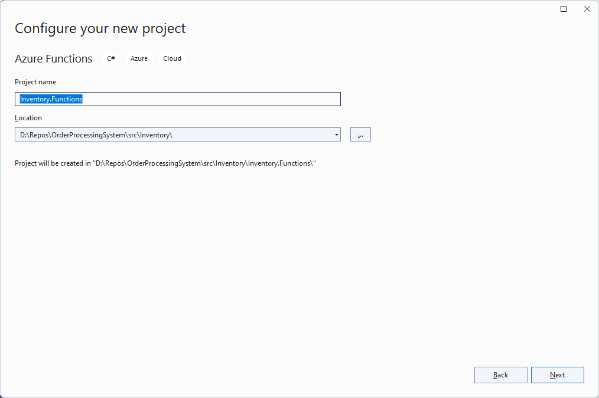
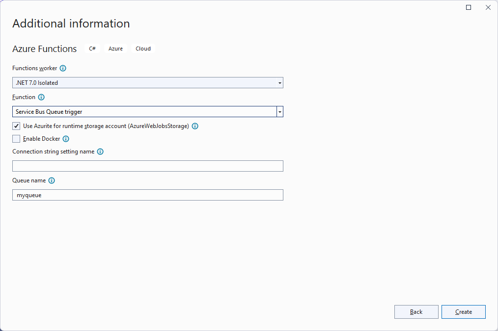

# 06 - Reserve Inventory (Inventory)

## User Story
After receiving a notification from the Purchase system that a purchase has been made, the Inventory system will reserved the purchase products and send a notification of such.

## Tasks
- 06A - [Add a shared access policy for Inventory to access the Place Order Service Bus queue](#add-a-shared-access-policy-for-inventory-to-access-the-place-order-service-bus-queue-06A)
- 06B - [Create the Inventory Reserved Event Hub](#create-the-inventory-reseved-event-hub-06b)
- 06C - [Add a shared access policy for Inventory to access the Inventory Reserved Event Hub](#add-a-shared-access-policy-for-inventory-to-access-the-inventory-reserved-event-hub)
- 06D - [Add service logic for user story](#add-service-logic-for-user-story-06d)
- 06E - [Test the Reserve Inventory User Story](#test-the-reserve-inventory-user-story-06e)

### Add a shared access policy for Inventory to access the Place Order Service Bus queue (06A)
1. From the [Azure Portal](https://portal.azure.com), click on the Service Bus account created for the workshop
1. Click **Queues** option on the left-hand menu
1. Click on the PlaceOrder queue
1. Click on the **Shared access policies** option on the left-hand menu
1. Click the **+ Add** button
1. In the **Add SAS Policy** blade, provide the enter the following:

- **Policy name**: Inventory
- **Manage**: Unchecked
- **Send**: Unchecked
- **Listen**:Checked

7. Click the **Create** button
1. Click on the policy you just created
1. Copy the **Connection string-primary key**

### Create the Inventory Reserved Event Hub (06B)
1. From the [Azure Portal](https://portal.azure.com), navigate to the Event Hub Namespace you created for this workshop.
1. Click the **+ Event Hub** button
1. Enter the following information:

| Field | Value |
|-------|-------|
| Name | The name of the Order Placed event hub |
| Partition count | 1 |
| Cleanup policy | Delete |
| Retention time (hrs) | 1 |

4. Click the **Review + create** button
1. Click the **Create** button

### Add a shared access policy for Inventory to access the Inventory Reserved Event Hub (06C)
1. From the **Event Hubs** listing, click on the **Inventory Reserved** event hub you just created.
1. Click on the **Shared access policies** option under **Settings* from the left-hand menu
1. Click the **Add** button
1. In the **Add SAS Policy** blade, enter the following:

| Field       | Value     |
|-------------|-----------|
| Policy name | Inventory |
| Manage      | Unchecked |
| Send        | Checked   |
| Listen      | Unchecked |

4. Click the **Create** button

**Copy the SAS Policy Connection String**
1. Click on the policy you just created
1. Copy the **Connection string-primary key**

**Add the connection string to Key Vault**
1. Navigate to the Key Vault you created for the workshop.
1. Click on the **Secrets** option in the left-hand menu
1. Click the **+ Generate/Import** button
1. Enter the following information

| Field        | Value                                |
|--------------|--------------------------------------|
| Name         | EventHub-InventoryReserved-Inventory |
| Secret value | The copied key                       | 

5. Click the **Create** button

**Add the Key Vault reference to Azure App Config**
1. Navigate to the GitHub repository you created for the workshop
1. Edit the **config/secretreferences.json** file
1. Add the Inventory:EventHubs:PlaceOrder:ConnectionString element

~~~
"Inventory": {
  "EventHubs": {
    "InventoryReserved": {
      "ConnectionString": "{\"uri\":\"https://kv-opswalkthough.vault.azure.net/secrets/EventHub-InventoryReserved-Inventory\"}"
    }
  }
}
~~~

4. Click the **Commit changes...** button
1. Verify that the AppConfig GitHub Action completed successfully

### Add service logic for user story (06D)
1. Right click on the **Inventory.Services** and select **Add > Class**
1. Name the new class **InventoryServices.cs**
1. Replace the existing code with the following:

~~~
namespace BuildingBricks.Inventory;

public class InventoryServices : ServicesBase
{

	public InventoryServices(ConfigServices configServices) : base(configServices) { }

}
~~~

**Add logic to get the inventory status of a product**
Add the following private methods to the InventoryServices class:

~~~
private static async Task<InventoryUpdatedMessage?> GetInventoryStatusAsync(string productId, InventoryContext inventoryContext)
{
	List<InventoryTransaction> inventoryTransactions = await inventoryContext.InventoryTransactions.Where(x => x.ProductId == productId).ToListAsync();
	if (inventoryTransactions.Any())
		return new InventoryUpdatedMessage()
		{
			ProductId = productId,
			InventoryOnHand = inventoryTransactions.Sum(x => x.InventoryCredit) - inventoryTransactions.Sum(x => x.InventoryDebit),
			InventoryReserved = inventoryTransactions.Sum(x => x.InventoryReserve),
			InventoryAvailable = inventoryTransactions.Sum(x => x.InventoryCredit) - (inventoryTransactions.Sum(x => x.InventoryDebit) + inventoryTransactions.Sum(x => x.InventoryReserve)),
			LastUpdate = inventoryTransactions.Max(x => x.ActionDateTime)
		};
	else
		return null;
}
~~~

**Add logic to perform tasks for user story**
Add the following ReserveItemForOrderAsync method to the InventoryServices class:

~~~
public async Task ReserveItemForOrderAsync(ProductPurchasedMessage productPurchasedMessage)
{

	using InventoryContext inventoryContext = new(_configServices);
	Product? product = await inventoryContext.Products.FirstOrDefaultAsync(x => x.ProductId == productPurchasedMessage.ProductId);
	if (product is not null)
	{

		// Update the inventory status
		InventoryTransaction inventoryTransaction = new()
		{
			ProductId = product.ProductId,
			InventoryActionId = InventoryActions.ReservedForOrder,
			InventoryReserve = productPurchasedMessage.Quantity,
			OrderNumber = productPurchasedMessage.PurchaseId
		};
		await inventoryContext.InventoryTransactions.AddAsync(inventoryTransaction);
		await inventoryContext.SaveChangesAsync();

		// Get the inventory status
		InventoryUpdatedMessage? inventoryStatusResponse = await GetInventoryStatusAsync(product.ProductId, inventoryContext);

		// Send the inventory reserved message
		InventoryReservedMessage inventoryReservedMessage = new()
		{
			CustomerId = productPurchasedMessage.CustomerId,
			OrderId = productPurchasedMessage.PurchaseId,
			ProductId = productPurchasedMessage.ProductId,
			ProductName = product.ProductName,
			QuantityOnHand = inventoryStatusResponse?.InventoryOnHand - inventoryStatusResponse?.InventoryReserved ?? 0,
			Backordered = inventoryStatusResponse is null || inventoryStatusResponse.InventoryAvailable < 1
		};

		await SendMessageToEventHubAsync(
			_configServices.InventoryEventHubsInventoryReservedConnectionString,
			_configServices.InventoryEventHubsInventoryReservedEventHubName,
			JsonSerializer.Serialize(inventoryReservedMessage));

	}

}
~~~

### Create an Azure Function to trigger the inventory to be reserved (6C)
1. From Visual Studio, right-click on the **Inventory** solution folder and select the **Add > New Project** option.
1. Select the **Azure Functions* project template
1. From the **Configure your new project** dialog, enter the following values:

| Field        | Value                                              |
|--------------|----------------------------------------------------|
| Project name | Inventory.Functions                                |
| Location     | The Inventory subfolder in your solution directory |

4. From the **Additional information** dialog, enter the following values:

| Field            | Value                     |
|------------------|---------------------------|
| Functions worker | .NET 7.0 Isolated         |
| Function         | Service Bus Queue trigger |

5. Click the **Create** button
1. Delete the generated **Function1.cs** file
1. Add project reference to the Inventory.Services project.
1. Open the **Program.cs** file in the **Inventory.Functions** project and replace the code with the following:

~~~
using BuildingBricks.Core;
using BuildingBricks.Inventory;
using Microsoft.Extensions.DependencyInjection;
using Microsoft.Extensions.Hosting;

string environment = Environment.GetEnvironmentVariable("AZURE_FUNCTIONS_ENVIRONMENT")!;
string appConfigEndpoint = Environment.GetEnvironmentVariable("AppConfigEndpoint")!;
ConfigServices configServices = new ConfigServices(appConfigEndpoint, environment);

InventoryServices inventoryServices = new(configServices);

IHost host = new HostBuilder()
	.ConfigureFunctionsWorkerDefaults()
	.ConfigureServices(s =>
	{
		s.AddSingleton((s) => { return inventoryServices; });
	})
	.Build();

host.Run();
~~~

9. Open the **local.settings.json** file in the **Inventory.Functions** project and add the AppConfigEndpoint setting:

~~~
{
  "IsEncrypted": false,
  "Values": {
    "AzureWebJobsStorage": "UseDevelopmentStorage=true",
    "FUNCTIONS_WORKER_RUNTIME": "dotnet-isolated",
    "AppConfigEndpoint": "{APP_CONFIG_ENDPOINT}",
    "ServiceBusConnectionString": "{SERVICE_BUS_CONNECTION_STRING}",
    "OrderPlacedQueue": "{ORDER_PLACED_QUEUE}"
  }
}
~~~

10. Right-click on the **Inventory.Functions** project and select **Add > New Folder**; name the folder **Functions**
1. Right-click on the **Functions** folder and select **Add > Class**
1. Name the new class **PlaceOrderMonitor.cs**
1. Replace the auto-generated code with the following:

~~~
using Azure.Messaging.ServiceBus;
using BuildingBricks.Core.EventMessages;
using BuildingBricks.Inventory;
using Microsoft.Azure.Functions.Worker;
using Microsoft.Extensions.Logging;

namespace Inventory.Functions;

public class OrderPlacedMonitor
{

	private readonly ILogger<OrderPlacedMonitor> _logger;
	private readonly InventoryServices _inventoryServices;

	public OrderPlacedMonitor(
		ILogger<OrderPlacedMonitor> logger,
		InventoryServices inventoryServices)
	{
		_logger = logger;
		_inventoryServices = inventoryServices;
	}

	[Function("Inventory-OrderPlacedMonitor")]
	public async Task RunAsync([ServiceBusTrigger("%OrderPlacedQueue%", Connection = "ServiceBusConnectionString", IsSessionsEnabled = true)] ServiceBusReceivedMessage message)
	{
		_logger.LogInformation("Message ID: {id}", message.MessageId);
		ProductPurchasedMessage productPurchasedMessage = message.Body.ToObjectFromJson<ProductPurchasedMessage>();
		await _inventoryServices.ReserveItemForOrderAsync(productPurchasedMessage);
	}

}
~~~

15. Right-click the **OrderProcessingSystem** solution and select **Configure Startup Projects**
1. Add Inventory.Functions to the list of projects to be started

.png)

### Test the Reserve Inventory User Story (6E)
1. Open Postman and create a new request
1. Change the HTTP verb to **Post**
1. Paste the **PlaceOrder** endpoint URL
1. Click the **Body** tab
1. Select **raw** and **JSON**
1. Enter the JSON below:

~~~
{
  "customerId": 1,
  "items":
  [
    {
      "productId": "10255",
      "quantity": 1
    }
  ]
}
~~~

7. Click the **Send** button
8. Validate that the Inventory.InventoryTransaction record was created