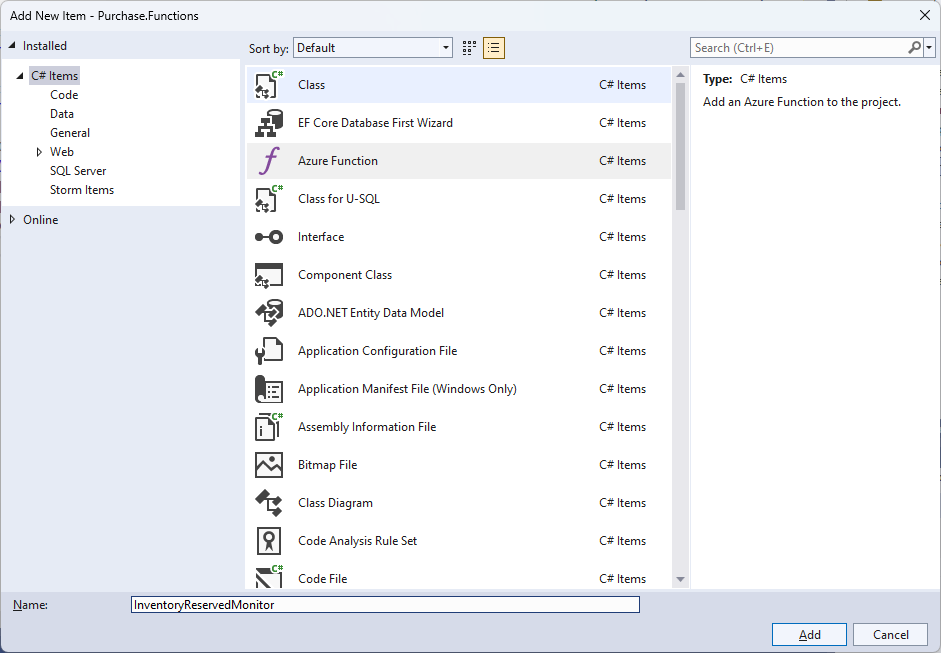
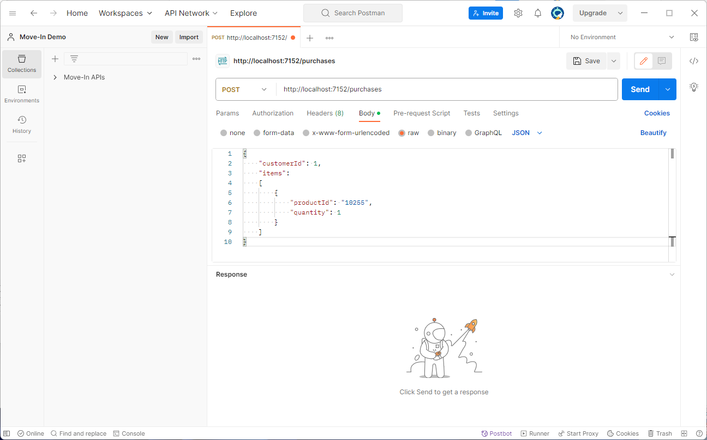

# 08 - Update Purchase Status on Inventory Reserve

## User Story
After receiving a notification from the Inventory system that the inventory has been reserved for an order, the Purchase system will update the status of the purchase line item. If all of the line items for the purchase have been updated, then the purchase status will be updated.

## Tasks
- 08A - [Add consumer group for Purchase on the Inventory Reserved Event Hub](#add-consumer-group-for-purchase-on-the-invnetory-reserved-event-hub-08a)
- 08B - [Add service logic for user story](#add-service-logic-for-user-story-08b)
- 08C - [Create an Azure Function to trigger the purchase update upon inventory being reserved](#create-an-azure-function-to-trigger-the-purchase-update-upon-inventory-being-reserved-08c
- 08D - [Test the Update Purchase Status on Inventory Reserve User Story](#test-the-update-purchase-status-on-inventory-reserve-user-story-08d)

### Add consumer group for Purchase on the Inventory Reserved Event Hub (08A)
1. From the [Azure Portal](https://azure.portal.com), navigate to the Event Hub namespace created from the workshop.
1. Click on the **Inventory Reserved** event hub from the **Event Hubs** listing.
1. Click on the **Consumer groups** option under **Entities** on the left-hand navigation panel
1. Click the **+ Consumer group** button.
1. Enter *purchase* in the **Name** field.
1. Click the **Create** button.

### Add a shared access policy for Purchase to access the Inventory Reserved event hub (08A)
1. Click on the **Shared access policies** option under **Settings** on the left-hand navigation panel.
1. Click the **+ Add** button
1. In the **Add SAS Policy** blade, provide the enter the following:

- **Policy name**: Purchase
- **Manage**: Unchecked
- **Send**: Unchecked
- **Listen**:Checked

7. Click the **Create** button
1. Click on the policy you just created
1. Copy the **Connection string-primary key**

### Add service logic for user story (07B)
1. From Visual Studio, open the **PurchaseServices.cs** file.
1. Add the **UpdatePurchaseItemStatusAsync** method to the PurchaseServices class.

~~~
	public async Task UpdatePurchaseItemStatusAsync(
		string purchaseId,
		string productId,
		int purchaseStatusId)
	{

		using PurchaseContext purchaseContext = new(_configServices);
		CustomerPurchase? purchase = await purchaseContext.CustomerPurchases
			.Include(x => x.PurchaseLineItems)
			.FirstOrDefaultAsync(x => x.CustomerPurchaseId == purchaseId);
		if (purchase is not null)
		{

			PurchaseLineItem? purchaseLineItem = purchase.PurchaseLineItems.FirstOrDefault(x => x.ProductId == productId);
			if (purchaseLineItem is not null)
			{
				purchaseLineItem.PurchaseStatusId = purchaseStatusId;
				await purchaseContext.SaveChangesAsync();
			}

			if (purchase.PurchaseLineItems.FirstOrDefault(x => x.PurchaseStatusId != purchaseStatusId) is null && purchase.PurchaseStatusId != purchaseStatusId)
			{
				purchase.PurchaseStatusId = purchaseStatusId;
				await purchaseContext.SaveChangesAsync();
			}
		}

	}
~~~

### Create an Azure Function to trigger the purchase update upon inventory being reserved (8C)
1. From Visual Studio, right-click on the **Functions** folder within the **Purchase.Functions** folder and click the **Add > New Azure Function**
1. Enter **InventoryReservedMonitor.cs** for the name of the new Azure Function class.

3. Click the **Add** button
1. Select the **Event Hub trigger** and specify the following values:

| Field                          | Value                             |
|--------------------------------|-----------------------------------|
| Connection string setting name | InventoryReservedConnectionString |
| Event Hub name                 | %InventorReservedEventHub%        |

5. Click the **Add** button.
1. Replace the auto-generated code with the following:

~~~
using Azure.Messaging.EventHubs;
using BuildingBricks.EventMessages;
using BuildingBricks.Purchase.Constants;
using Microsoft.Azure.Functions.Worker;
using Microsoft.Extensions.Logging;
using System.Text.Json;

namespace BuildingBricks.Purchase.Functions;

public class InventoryReservedMonitor
{

	private readonly ILogger<InventoryReservedMonitor> _logger;
	private readonly PurchaseServices _purchaseServices;

	public InventoryReservedMonitor(
		ILogger<InventoryReservedMonitor> logger,
		PurchaseServices purchaseServices)
	{
		_logger = logger;
		_purchaseServices = purchaseServices;
	}

	[Function(nameof(InventoryReservedMonitor))]
	public async Task RunAsync([EventHubTrigger("%InventoryReservedEventHub%", Connection = "InventoryReservedConnectionString", ConsumerGroup = "%InventoryReservedConsumerGroup%")] EventData[] eventMessages)
	{
		foreach (EventData eventMessage in eventMessages)
		{
			InventoryReservedMessage? inventoryReservedMessage = JsonSerializer.Deserialize<InventoryReservedMessage>(eventMessage.EventBody);
			if (inventoryReservedMessage is not null)
			{
				_logger.LogInformation("Inventory Reserved Event Received");
				await _purchaseServices.UpdatePurchaseItemStatusAsync(inventoryReservedMessage.OrderId, inventoryReservedMessage.ProductId, PurchaseStatuses.Reserved);
			}
		}
	}

}
~~~

7. Open the **local.settings.json** file within the **Purchase.Functions** project.
1. Add the InventoryReservedConnectionString, InventoryReservedEventHub, and InventoryReservedConsumerGroup values.

~~~
{
  "IsEncrypted": false,
  "Values": {
    "AzureWebJobsStorage": "UseDevelopmentStorage=true",
    "FUNCTIONS_WORKER_RUNTIME": "dotnet-isolated",
    "AppConfigEndpoint": "{APP_CONFIG_ENDPOINT}",
    "InventoryReservedConnectionString": "{INVENTORY_RESERVED_EVENT_HUB_CONNECTION_STRING}",
    "InventoryReservedEventHub": "{INVENTORY_RESERVED_EVENT_HUB_NAME}",
    "InventoryReservedConsumerGroup": "purchase"
  }
}
~~~

### Test the Update Purchase Status on Inventory Reserve User Story (08D)
1. Open Postman and create a new request
1. Change the HTTP verb to **Post**
1. Paste the **PlaceOrder** endpoint URL
1. Click the **Body** tab
1. Select **raw** and **JSON**
1. Enter the JSON below:

~~~
{
  "customerId": 1,
  "items":
  [
    {
      "productId": "10255",
      "quantity": 1
    }
  ]
}
~~~

7. Click the **Send** button
8. Validate that the appropriate Purchase.CustomerPurchase and Purchase.PurchaseLineItem record was updated